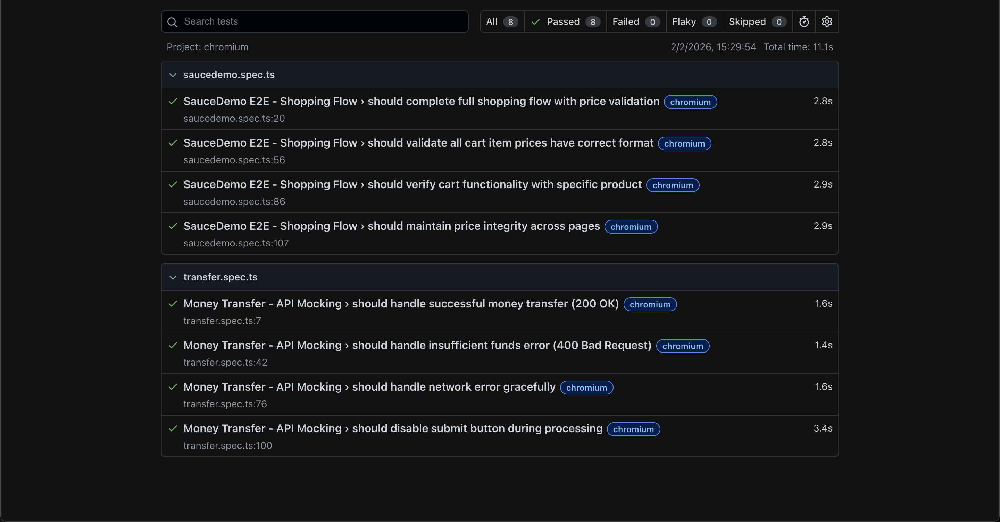

# AnyTax QA Assessment - Playwright Testing Suite

## Project Overview

Automated test suite demonstrating API mocking, E2E testing, and Page Object Model implementation with Playwright and TypeScript.

## Test Scenarios

### Money Transfer API Mocking (tests/transfer.spec.ts)
- Success Flow: Mock 200 OK response with transaction ID
- Error Flow: Mock 400 Bad Request for insufficient funds
- Network Error: Handle connection failures
- Loading State: Verify button states during processing

### SauceDemo E2E Testing (tests/saucedemo.spec.ts)
- Login with standard_user
- Add products to cart
- Verify items in cart
- Price validation: $ format and decimal precision
- Data integrity across pages

## Project Structure
```
anytax-qa-assessment/
├── pages/                  # Page Object Models
├── tests/                  # Test specifications
├── public/                 # HTML files
├── playwright.config.ts    # Playwright configuration
└── package.json           # Dependencies
```

## Installation

**Prerequisites:** Node.js v18+
```bash
# Clone repository
git clone <git@github.com:irrivero/fintech-qa-automation.git>
cd anytax-qa-assessment

# Install dependencies
npm install

# Install Playwright browsers
npx playwright install chromium
```

## Running Tests
```bash
# Run all tests
npm test

# Run specific suites
npm run test:transfer
npm run test:saucedemo

# View HTML report
npm run test:report
```

## Test Results



All 8 tests passing: 4 API mocking tests + 4 E2E tests

## Key Features

**Page Object Model**
- Clean separation of concerns
- Type-safe with TypeScript
- Reusable and maintainable

**API Mocking**
```typescript
await page.route('**/api/transfer', async (route) => {
  await route.fulfill({
    status: 200,
    contentType: 'application/json',
    body: JSON.stringify({ status: 'success', transactionId: '12345' })
  });
});
```

**Stable Selectors**
- data-testid attributes
- Playwright auto-waiting (no hardcoded waits)

**FinTech Price Validation**
```typescript
expect(price).toMatch(/^\$\d+\.\d{2}$/);
```

## Technologies

- Playwright
- TypeScript
- Page Object Model
- HTML Reporter


## Author

Irene Rivero Casal  
irene.rivero.casal@gmail.com